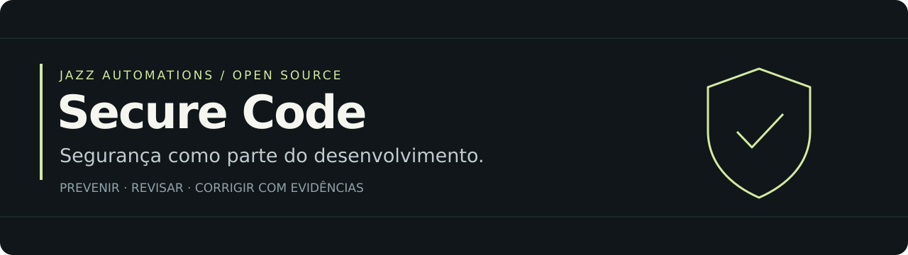
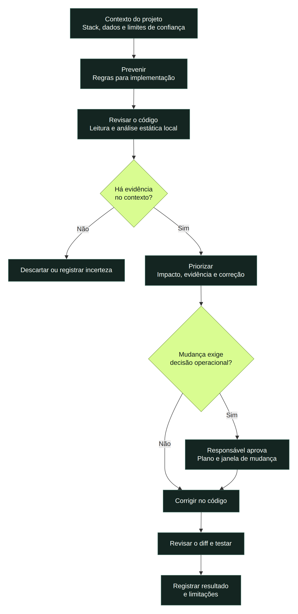
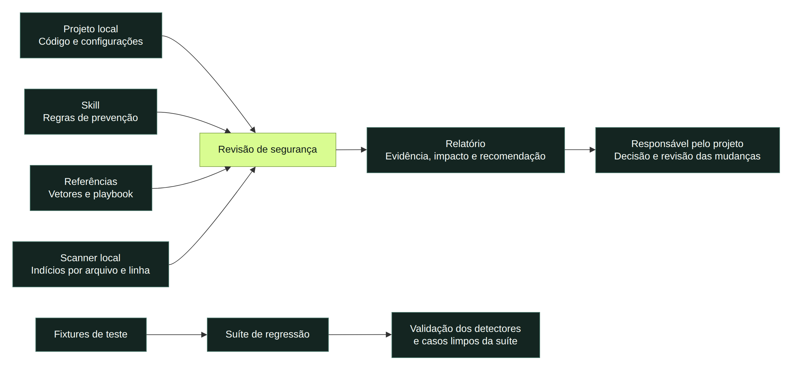

<p align="center">
  <a href="LICENSE"></a>
  
  
</p>

**Regras e ferramentas para apoiar a segurança de aplicações desenvolvidas com agentes de IA.** O Secure Code combina orientações de implementação, análise estática local e revisão contextual para transformar indícios em recomendações de correção.

Para desenvolvedores e equipes que usam IA no dia a dia e querem tratar autenticação, dados, integrações e dependências com mais cuidado.

[Como funciona](#como-funciona) · [Componentes](#componentes) · [Começar](#começar) · [Cobertura](#cobertura) · [Validação](#validação-e-limites) · [Contribuir](CONTRIBUTING.md)

## Como funciona

| Etapa | O que acontece | Entrega |
| :--- | :--- | :--- |
| **Prevenir** | Entender a stack e aplicar regras durante a implementação. | Decisões explícitas sobre dados, permissões e limites de confiança. |
| **Revisar** | Ler o código, analisar indícios e conferir o contexto. | Achados com evidência e incertezas identificadas. |
| **Corrigir** | Priorizar mudanças, revisar o diff e verificar o resultado. | Correções no código e decisões operacionais encaminhadas ao responsável. |

O scanner aponta padrões. A leitura do código determina se o indício se sustenta. Ausência de achados não comprova ausência de falhas.

<p align="center">
  
</p>

[Editar no draw.io](docs/diagrams/review-flow.drawio) · [Ver SVG](docs/diagrams/review-flow.svg) · [Fonte do diagrama](docs/diagrams/review-flow.mmd)

## Componentes

As instruções orientam o agente; o scanner auxilia a leitura; o relatório organiza a decisão. A suíte de testes verifica os detectores com exemplos controlados.



[Editar no draw.io](docs/diagrams/architecture.drawio) · [Ver SVG](docs/diagrams/architecture.svg) · [Fonte do diagrama](docs/diagrams/architecture.mmd)

| Componente | Papel |
| :--- | :--- |
| [`secure-code/SKILL.md`](secure-code/SKILL.md) | Instruções de prevenção, revisão e correção para o agente. |
| [`scan.sh`](scan.sh) | Scanner com heurísticas de análise estática e saída textual ou JSON. |
| [`references/`](secure-code/references/) | Catálogo de vetores, playbook de revisão e modelo de relatório. |
| [`tests/`](tests/) | Fixtures controladas e suíte de regressão dos detectores. |
| [`ci/scan.yml`](ci/scan.yml) | Exemplo de workflow; precisa ser instalado no projeto. |

Os diagramas apresentam o fluxo de **revisão do código local**. O repositório também contém verificações remotas; elas não fazem parte deste guia de início rápido.

## Começar

### 1. Conheça as regras

Leia a [skill](secure-code/SKILL.md) e o [playbook de revisão](secure-code/references/code-review-playbook.md). Comece pelo contexto da aplicação: dados tratados, autenticação, integrações e versões utilizadas.

### 2. Use a skill no Claude Code

Clone o repositório e copie a pasta da skill para o diretório pessoal de skills:

```bash
git clone https://github.com/jazzautomations/secure-code-skill.git
mkdir -p ~/.claude/skills
cp -R secure-code-skill/secure-code ~/.claude/skills/
```

Se já existir uma instalação, revise as alterações antes de substituir seus arquivos. Para compartilhar a skill com uma equipe, utilize `.claude/skills/secure-code/` dentro do projeto. Consulte a [documentação do Claude Code](https://code.claude.com/docs/en/skills) para os locais e mecanismos de descoberta suportados.

Um pedido de revisão pode ser simples:

> Revise o código deste projeto com a skill secure-code. Comece pela stack e pelos dados tratados, confira os indícios no contexto e entregue recomendações com evidência, impacto e limitações.

Em outros assistentes, as regras podem servir como material de referência; o mecanismo de instalação depende da ferramenta.

### 3. Confira a suíte local

```bash
cd secure-code-skill
make test
```

Para análise estática, o scanner usa **Bash 4+ e GNU grep**, incluindo suporte a `grep -P`. O Bash 3.2 fornecido em instalações antigas do macOS não é suficiente. Integrações opcionais de dependências usam `osv-scanner` e `govulncheck` quando presentes.

## Cobertura

A documentação aborda 33 vetores. Isso não significa 33 detecções automáticas: parte da avaliação depende da leitura das regras de negócio e das configurações.

| Área | Exemplos de revisão |
| :--- | :--- |
| Identidade e acesso | Autorização por recurso, sessões, JWT e políticas de acesso aos dados. |
| Dados e segredos | Credenciais, exposição de informações, logs, armazenamento e envio de dados a modelos. |
| Entradas e saídas | Validação no servidor, consultas parametrizadas, renderização de conteúdo e uploads. |
| Integrações | Webhooks, limites de uso, chamadas externas e tratamento de falhas. |
| Dependências e operação | Versões, cadeia de fornecimento, configuração de CI/CD e observabilidade. |
| Regras de negócio | Concorrência, limites, transições de estado e decisões que exigem contexto. |

Há exemplos e heurísticas para JavaScript/TypeScript, Python, Go e PHP. A cobertura varia por linguagem e por vetor; não é uma análise semântica completa dessas stacks.

## Validação e limites

**Suíte local executada em 8 de setembro de 2026: 21 verificações passaram, nenhuma falhou.** São 20 verificações de categorias de detecção e uma verificação agregada que exige ausência de achados críticos ou altos nas fixtures limpas.

Esse resultado comprova o comportamento nos exemplos da suíte. Não mede a precisão em qualquer aplicação nem garante ausência de falsos positivos fora dela.

- Heurísticas de texto não compreendem toda a execução, o fluxo de dados ou as regras de negócio.
- Um padrão encontrado pode estar mitigado, ser código de teste ou depender de contexto ausente.
- Mudanças de credenciais, permissões e produção precisam de avaliação do responsável pela operação.
- O [registro de benchmarks](BENCHMARK.md) documenta experiências anteriores do projeto. Esses resultados externos não foram repetidos nesta revisão da documentação.

O exemplo de CI em `ci/scan.yml` executa a suíte e um relatório do próprio repositório. A etapa de relatório contém `|| true`: **ela não bloqueia o build por achados**. Não há workflow ativo apenas por esse arquivo existir na pasta `ci/`.

## Navegue pelo projeto

```text
secure-code-skill/
├── README.md
├── assets/                    # Identidade visual
├── docs/diagrams/             # Draw.io editável, fontes e imagens
├── secure-code/
│   ├── SKILL.md               # Instruções para o agente
│   └── references/            # Vetores, playbook e relatório
├── scan.sh                    # Scanner
├── tests/                     # Fixtures e suíte local
├── ci/scan.yml                # Exemplo de integração contínua
├── BENCHMARK.md               # Registro de avaliações anteriores
└── CONTRIBUTING.md
```

## Contribuir

Sugestões de clareza, correções, casos de falso positivo e melhorias nos testes são bem-vindos. Explique o comportamento esperado e use exemplos mínimos, sem credenciais ou dados de pessoas. Veja o [guia de contribuição](CONTRIBUTING.md).

Os diagramas foram criados com o **MCP do draw.io** e exportados com o renderizador do serviço. Os arquivos `.drawio` podem ser abertos no editor para alterar textos, formas e conexões. As fontes `.mmd` também estão versionadas.

## Quem constrói

Um projeto de **[Felipe Salvego / Jazz Automations](https://github.com/jazzautomations)**: desenvolvimento de software, integrações e sistemas de IA.

[Conheça a Jazz](https://jazzautomations.com.br) · [Converse no LinkedIn](https://www.linkedin.com/in/felipesalvego/)

[Licença MIT](LICENSE) — uso, adaptação e distribuição conforme os termos da licença.
